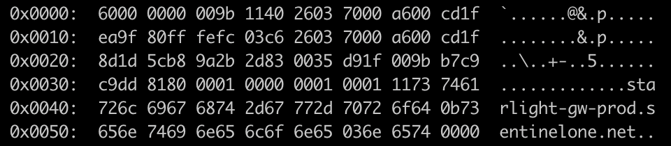

# DNS Parse

## Project Goal 

To make a CLI DNS parser which can convert hexdumps (from tcpdump or pcap) into human-readable DNS record(s).

i.e.
 -> 
```
Header { id: 25996, qr: true, opcode: QUERY, aa: false, tc: false, rd: true, ra: true, rcode: NoErr, qdcount: 1, ancount: 1, nscount: 0, arcount: 1 }
Question Record {...} ...
```

## Overview
- Learning some Rust basics.
- Building DNS message parsing from scratch (based on definition in RFC: https://datatracker.ietf.org/doc/html/rfc1035).
- Inspired by https://blog.adamchalmers.com/making-a-dns-client/

## Tasks
- [x] Parsing DNS header /w nom
- [ ] Parsing DNS question section /w nom
- [ ] Parsing DNS resource record /w nom
- [ ] Parsing DNS message with deku
- [ ] Adding basic CLI features
- [ ] ???
